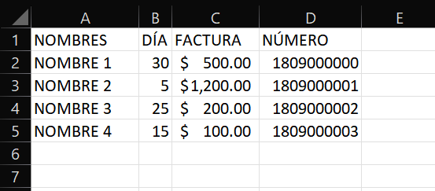

# Task-automation-with-Google-Calendar-and-WhatsApp
Repository that automates the creation, deletion, and update of events in Google Calendar with the Google API and sends 
automatic messages on WhatsApp using the pywhatkit library.

## What does this repository do?
This repository starts from reading an xlsx file:

*File structure example*

From reading, the program extracts information about customers 
**[(personal training: Saiyan Viking)](https://www.instagram.com/saiyan_vikingoficial/)**.
With the extracted data, the program tries to make a call to the Google Calendar API to load events 
for the current month, where the client and the amount that should be charged for the month's services are 
specified. Then it tries to send a message via WhatsApp to the client to remind them that today (notification)
or within a week (pre-notification) they must make a payment for the services of the month, specifying the amount.

To automate the execution of the module every time the computer is turned on, place a shortcut to the main.py file from 
the root directory (for windows 10): **C:\ProgramData\Microsoft\Windows\Start Menu\Programs\StartUp.**

## How does the code work?

1.	Install the additional modules in your Python interpreter.
2.	Download the latest version from the repository, 
**[you can use the tags](https://github.com/JoseMHU/Task-automation-with-Google-Calendar-and-WhatsApp/tags)**.
3.	First Boot Configurations:

   * For the program to work correctly, you must first log in to **[WhatsApp Web](https://web.whatsapp.com/)** in your 
main browser. 
   * You must also configure the operation of the
**[Google Calendar API](https://developers.google.com/workspace/guides/create-project?hl=es-419)** in your personal 
Google account to use it as a personal (non-deployed) project and download the access credentials in json format. 
At the end, rename the file to "credentials" and save it in the "modules/settings" directory of repository.
   * In the same "modules/settings" directory of the repository. There is a .txt file called "file_path", in this you 
must put the absolute path with the name of the file and the .xlsx extension that you want to read. In the 2nd line of 
the "file_path" the name of the sheet to be read is specified.
     * Note: The file must have a structure like the one shown above in the "What does this repository do?". If you 
want to change the column "names" you will have to modify the repository code. 
4. Run the main file from root. If this is your first time running the program, a Google tab will open to grant access 
permissions to the Google Calendar API for your personal account.

## Important
This repository was created for academic purposes to practice automating processes with Python and to add more content 
to my GitHub profile. To make the code useful, the development was focused to help with the automation of tasks of a 
friend's **[Personal Trainer project (Saiyan Viking)](https://www.instagram.com/saiyan_vikingoficial/)**.

## Current status of the project
I am currently working on an update to add a new function to the project: *Sending daily messages to clients to ask for 
the hour of attendance at the GYM* (at the request of my friend for the needs he has in his personal business).

In the future I am thinking of creating a repository for the GUI management of a simple database to pass the 
administration from Excel to MongoDB, at that point, I will update this repository to add the option of reading to the 
database.